# 小石(miniEC) Build Guide

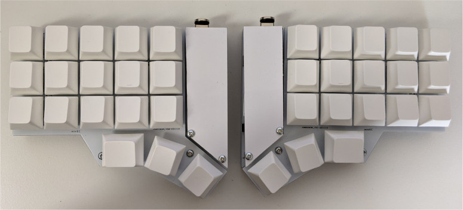

## 部品
### キット同封物

| 名前                            | 数量 |
|---------------------------------|------|
| メインPCB                       | 2    |
| トッププレート                  | 2    |
| ボトムプレート                  | 2    |
| 12pin socket                    | 4    |
| ハーフピッチ 16pin ソケット     | 2    |
| ハーフピッチ 16pin ピンヘッダー | 2    |
| TRRS ジャック                   | 2    |
| タクトスイッチ                  | 2    |
| M2 8.5 mm スペーサー            | 10   |
| M2 10mm スペーサー              | 4    |
| M5 2 mm スペーサー              | 10   |
| M2 4 mm ねじ                    | 28   |
| ゴム足                          | 8    |
| スキャンモジュール              | 2    |

### その他必要なもの

| 名前            | 数量     | 備考                                 |
|-----------------|----------|--------------------------------------|
| ProMicro        |        2 | [遊舎工房](https://shop.yushakobo.jp/products/pro-micro)や[TALP KEYBOARD](https://talpkeyboard.net/items/62e24e6f8a0bd07fe2d38137)から購入できます。動作検証は TALP KEYBOARD で購入した Type C 版で行いました  |
| スイッチ        | 36キー分 |  NIZ or BTO のスイッチのいずれかを選んでください。<br><br>NIZ スイッチを使う場合<br> - [NEW NIZ EC SWITCH](https://shop.yushakobo.jp/products/5224) <br>- [静電容量式キーボード用円錐バネ](https://shop.yushakobo.jp/products/4679)<br>- [静電容量ラバーシート](https://shop.yushakobo.jp/products/a0500er-01-1?_pos=1&_sid=63cdbf1e2&_ss=r)<br><br>BTO スイッチを使う場合<br>- [ADELCPS 静電容量スイッチ4点セット10組 ](https://btoshop.jp/products/adelcps?_pos=2&_sid=1532d7f0b&_ss=r) <br>- [ADELCPRU 静電容量ラバーシート](https://btoshop.jp/products/adelcpru?_pos=1&_sid=1532d7f0b&_ss=r) |
| キーキャップ    | 36キー分 | CherryMX 用のものが使えます          |
| ProMicro カバー |        2 | [タミヤのプラバン](https://www.amazon.co.jp/dp/B00CF9RSYU/)などで自作してください |
| TRRS ケーブル   |     1     |                                      |


## 実装

build 環境用に qmk firmware の container image を用意しています。image size が大きいため予め image を pull してくることをおすすめします。

```bash
docker push goropikari/qmkfm:0.18.17
```

docker を使わずに qmk firmware 環境を用意する場合は [.devcontainer/Dockerfile](.devcontainer/Dockerfile) を参考に環境を整えてください

$\psi$ と書いてある面が左手用表、 $\varphi$ が書いてある面が右手用表です。


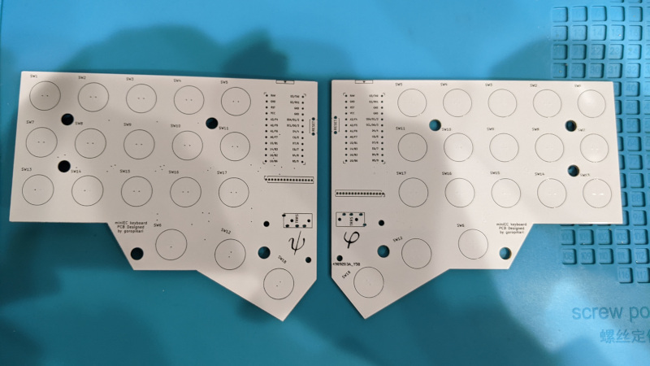


### ピンソケット・TRRS ジャック・タクトスイッチのハンダ付け
写真のようにピンソケット、TRRS ジャック・タクトスイッチを置きハンダ付けします。

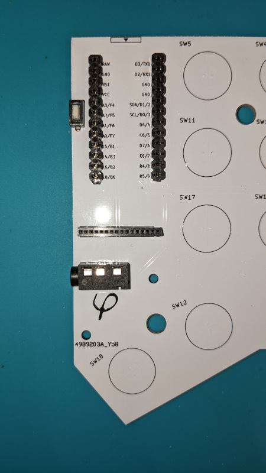


### 静電容量スキャン用モジュール

チップがある面を下にしピンヘッダーをハンダ付けしてください。

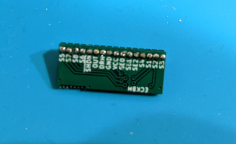


### ProMicro

チップ面を下にしてハンダ付けしてください


### スイッチ

トッププレートに M2 8.5 mm スペーサーをネジで固定します。

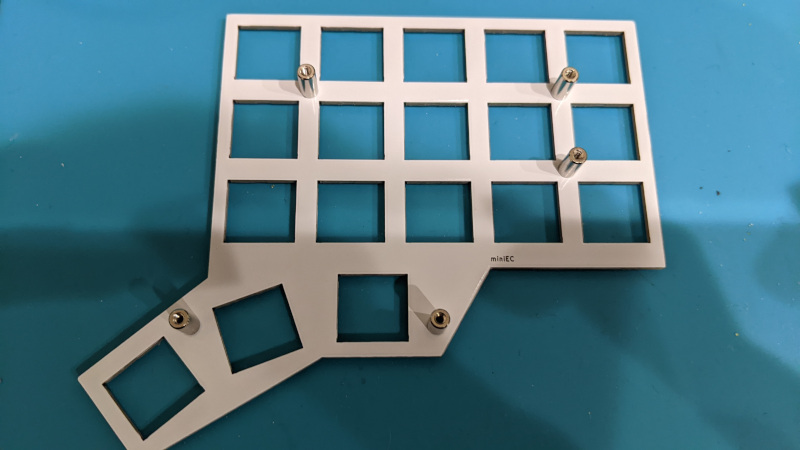

次にハウジングをトッププレートにハメていきます。

#### NIZ のスイッチの場合

ハウジングの爪があるほうが水平方向になるようにハメてください。垂直方向にハメるとハウジングがずれることがあります。

正しい向き
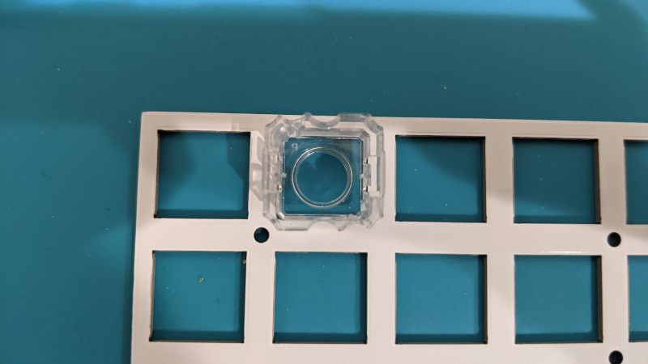

間違っている向き
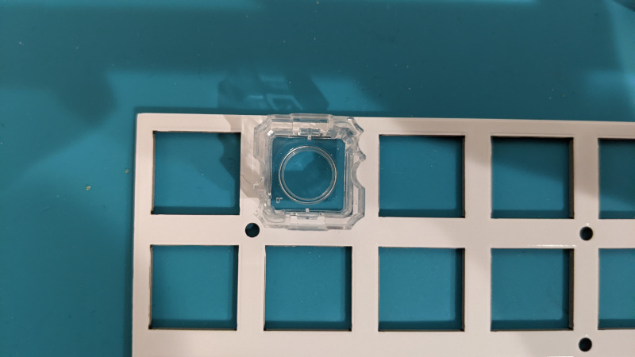


ハウジングを全てハメたらプランジャーをハウジングに入れていきます。プランジャーはハウジングのレールに沿うように入れてください。

正しい向き<br>
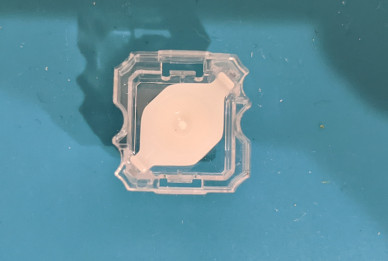

間違った向き<br>
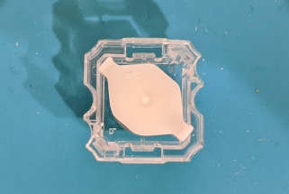


#### BTO のスイッチの場合

プランジャーに O リングを通し、ハウジングにプランジャーをハメます。
側面が丸く切り取られている方が水平方向になるようにハウジングをプレートにハメてください。BTO のハウジングは大きくそのままでは M2 スペーサーを通すことが出来ないので角をヤスリで削ってください。

#### NIZ・BTO 共通

ラバーシートから5スイッチ分ずつ6行分と親指キー用を1スイッチ分ずつハサミで切り出します。
片手分の切り出し方の例として下の写真の赤線で囲った部分のように切り出すのがおすすめです。
全てを1スイッチ分ずつ切り分けたほうが後述する穴あけがやりやすいですが、コニックリングがずれやすくなるのでまとめて切り出したほうがキーボードの入力が安定します。

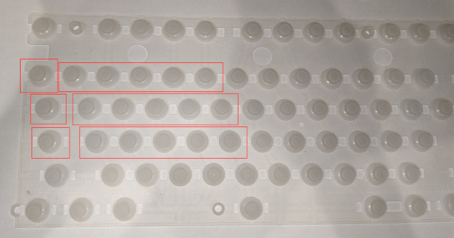

(オプション) ラバーシートの側面に穴を開けると打鍵が軽くなります。一方でタクタイル感が減りリニアに違い打鍵感になります。

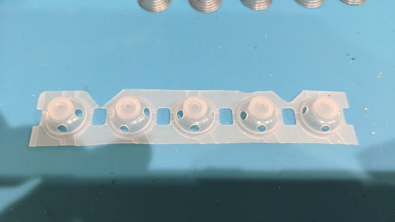

切り出したラバーシートをスイッチに乗せ、コニックリングを1つずつ配置します。コニックリングは重なりやすいので1つずつになっていることを確認しながら配置してください。重なっていた場合入力がおかしくなることがあります。この時テーブルに直置きした状態で作業するとうまくハメられないため基板を浮かせた状態にしてください。
私の場合は100均で購入したプラスチック製の小物入れを使って浮かせています。名刺やカードの短辺がおおよそ3キー分くらいの長さなのでカードケースなども使えると思います。


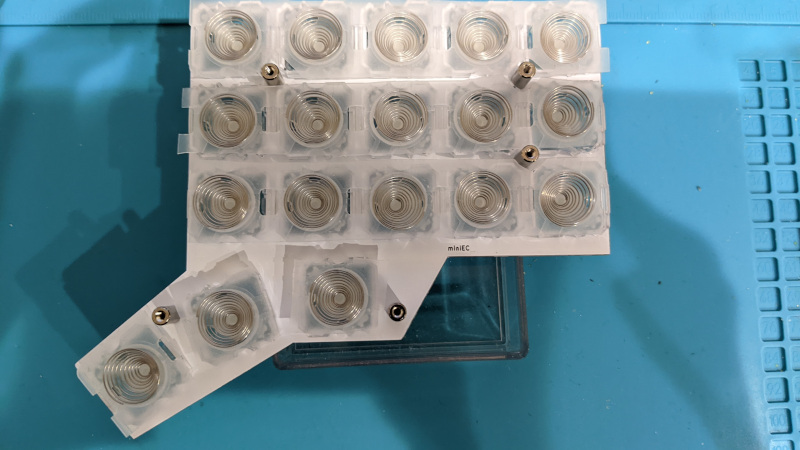


### (オプション) ProMicro カバー

タミヤのプラバンや塩ビ板などで自作した ProMicro カバーを使用する場合はこの時点で PCB に M2 10 mm スペーサーを取り付けておいてください

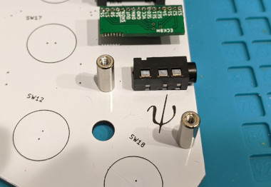


### メイン基板・ボトムプレート・ゴム足

メイン基板を乗せ、スペーサーのところに M5  2 mm スペーサーをおいてください。
最後にボトムプレートをかぶせネジで止め、ゴム足を貼り付けてください。

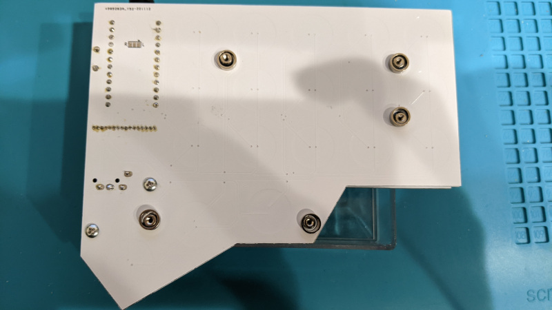

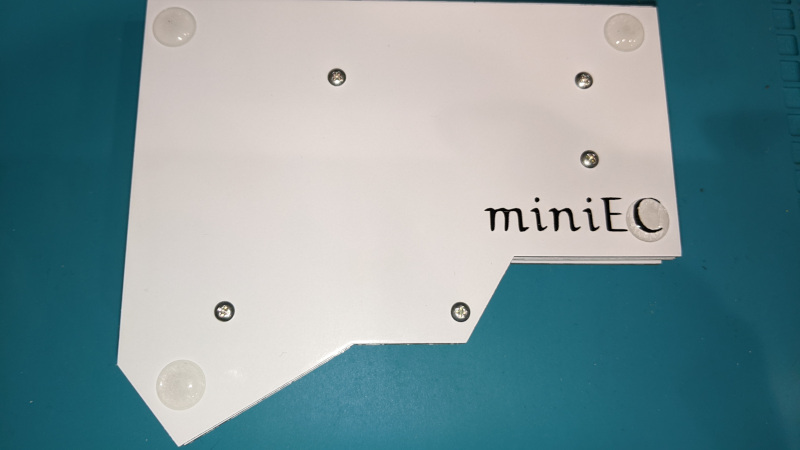


### ProMicro, 静電容量スキャンモジュールの設置

ProMicro と静電容量スキャンモジュールを下の写真の向きで設置してください。
静電容量スキャンモジュールは左右で向きが違うので注意してください。向きを間違えるとショートして部品が破損する可能性があります。

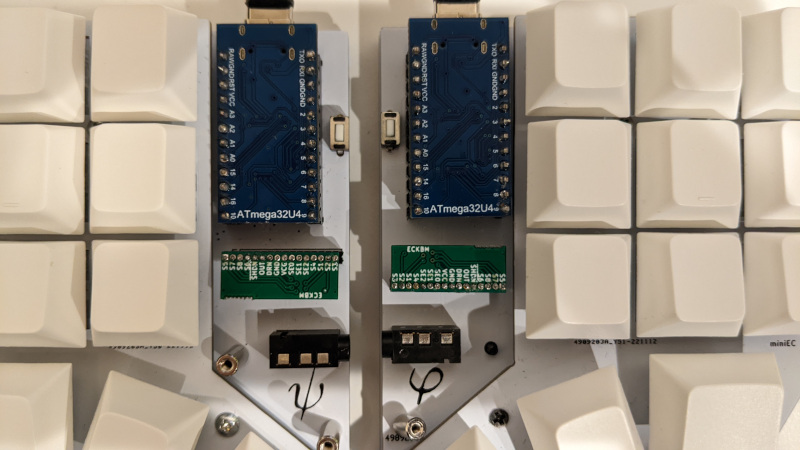
## Firmware 焼き

以降の動作確認は Linux(ArchLinux) で行っています。その他の OS をお使いの場合は適宜内容を読み替えてください

### 入力テスト用キーマップ

入力テスト用のキーマップを焼いて全キーが入力できるか確認してください

```bash
./docker_build.sh miniec:test:flash
```

うまく入力できなかった場合は後述の「[閾値を調整する](#閾値を調整する)」を参考にしきい値を調節してください。

入力がうまくできるようになったら `keyboards/miniec/keymaps/qwerty/keymap.c` をお好みのキーマップに編集して ProMicro に firmware を焼いて完成です！

左右どちら側に USB ケーブルを繋いでも問題なく動かせるようにするために以下のように左右ごとにコマンドを変えて firmware を適用してください。

```bash
./docker_build.sh miniec:qwerty:avrdude-split-left # 左用
./docker_build.sh miniec:qwerty:avrdude-split-right # 右用

# devcontainer を使っている場合
cd ~/qmk_firmware
make miniec:qwerty:avrdude-split-left # 左用
make miniec:qwerty:avrdude-split-right # 右用
```


### 閾値を調整する

静電容量無接点方式のキーボードではキーを押したときの静電容量の変化もとい電圧の変化を検出して押下判定をします。
`keyboards/miniec/config.h` にある `HIGH_THRESHOLD` に設定した値を超えるとキーが押された状態、`LOW_THRESHOLD` を下回るとキーが押されていない状態と判定されます。
`HIGH_THRESHOLD` を下回ったら押されていない状態と判定しても問題ないように思えますが、電圧が `HIGH_THRESHOLD` 近辺で揺らいでいた場合メカニカルキーボードのチャタリングに似た状態になってしまうため `LOW_THRESHOLD` が別に設定されています。

[hid_listen](https://www.pjrc.com/teensy/hid_listen.html) を使うと各キーの電圧(スケールされている)を見ることが出来ます。公式ページからバイナリを落としてくるか下記のように docker で立ち上げ、キーボードを PC に繋いでください。

```bash
docker run --rm -it --privileged -v /dev:/dev goropikari/hid_listen:1.01
```

下は読み取り値の2スキャン分の例です。
キーを押していない状態が 20 前後、押した状態では 90 と他よりも高くなっています。。
全キー分の値を見つつ最適な `HIGH_THRESHOLD`, `LOW_THRESHOLD` の値を決めてください

```
Waiting for device:
Listening:
  20  22  23  15  17  18
  15  15  19  21  14  17
  22  18  14  13  12  15

  90  20  23  16  16  17
  14  15  19  21  14  17
  22  18  14  13  12  15
```

