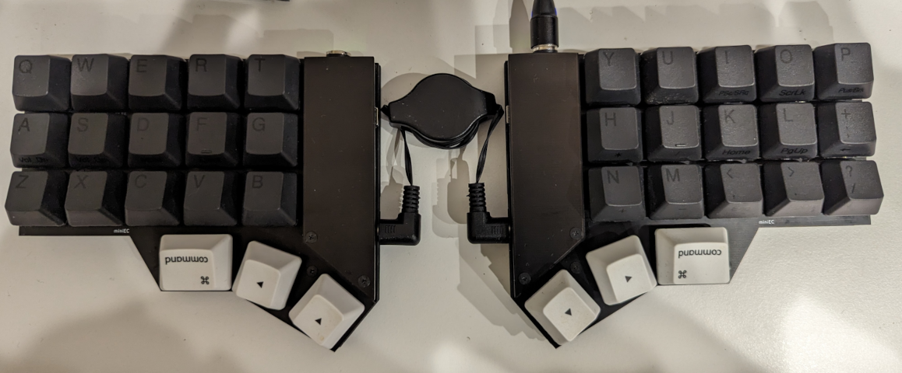

# 小石 (miniEC)

小石(miniEC) is a electrocapacitive split keyboard inspired by Manta40([KamoNanban](https://github.com/KamoNanban)), CorneEC([sekigon-gonnoc](https://github.com/sekigon-gonnoc)) and EC Helix([ginjake](https://github.com/ginjake)).

ビルドガイド
- [prototype, ~v1](https://github.com/goropikari/miniEC/blob/prototype/README.md)
- [v1~](https://github.com/goropikari/miniEC/blob/v1/docs/build_guide.md)
