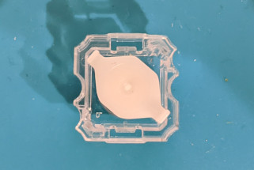

# 小石(miniEC) Build Guide


[販売ページ](https://pikarikbd.booth.pm/items/4799710)


## 部品
### キット同封物

| 名前                            | 数量 |
|---------------------------------|------|
| メインPCB                       | 2    |
| トッププレート                  | 2    |
| ボトムプレート                  | 2    |
| マイコンカバー                  | 2    |
| TRRS ジャック                   | 2    |
| タクトスイッチ                  | 2    |
| M2, 8 mm スペーサー             | 14   |
| M2, 5 mm ねじ                   | 28   |
| M4, 2 mm スペーサー             | 10   |
| ゴム足                          | 8    |

### その他必要なもの

| 名前            | 数量     | 備考                                 |
|-----------------|----------|--------------------------------------|
| ProMicro        |        2 | 動作確認済みは以下です<br>- https://shop.yushakobo.jp/products/pro-micro |
| 2.5~3.5 mm 12pin ピンヘッダー or コンスルー | 4 | ピンヘッダーであれば ProMicro を購入するとおそらく同封されています。コンスルーは遊舎工房や TALP KEYBOARD から購入できます。<br>- https://shop.yushakobo.jp/products/31 <br>- https://talpkeyboard.net/items/5e056626d790db16e2889233 |
| スイッチ        | 36キー分 | 使用できるスイッチに関しては「[動作確認済みスイッチ](switch.md)」をご参照ください |
| キーキャップ    | 36キー分 | NIZ, BTO のスイッチだと CherryMX 用のものが使えます          |
| TRRS or TRS ケーブル   |     1    | - https://shop.yushakobo.jp/products/trrs_cable<br>- https://www.amazon.co.jp/gp/product/B08T5TT859/ |


## 実装

### 表裏

チップがすでにはんだ付けされている面が裏です。


### ProMicro・TRRS ジャック・タクトスイッチのハンダ付け
写真のように ProMicro、TRRS ジャック、タクトスイッチ(リセットスイッチ)を配置しハンダ付けします。実装面をお間違えなきようお気をつけください。
最終的にチップが表面に出ないのが正しいです。


### スイッチ

トッププレートに M2, 8mm スペーサーをネジで固定します。


次にハウジングをトッププレートに嵌めていきます。(使用するハウジングに応じた記述に従ってください)

#### NIZ のスイッチの場合

ハウジングを下図のような向きにプレートに嵌めていきます。(NiZ のハウジングの場合はあまり向きにシビアではありませんが、中央にくるように配置してください。)


ハウジングを全て嵌めたらプランジャーをハウジングに入れていきます。プランジャーはハウジングのレールに沿うように入れてください。

正しい向き<br>


間違った向き<br>


トッププレートの穴の大きさの影響でプランジャーの滑りが悪くなることがあります。その場合は穴をヤスリで削って拡張してください。


#### BTO のスイッチの場合

プランジャーに O リングを通し、プランジャーを嵌めます。プランジャーはハウジングのレールに沿うように入れてください。


ハウジングを下図のような向きにプレートに嵌めていきます。爪が引っかかる向きに注意してください。(穴のサイズ的に間違った向きにはそもそもハマりません)


スペーサーが隅にある部分ではハウジングサイズが大きいためスペーサーと干渉します。その部分はハウジングの角をニッパーで切ったり、ヤスリで削ってください。(下の写真は東プレスイッチですが BTO のスイッチでも同様のことが起こります。)


トッププレートの穴の大きさの影響でプランジャーの滑りが悪くなることがあります。その場合は穴をヤスリで削って拡張してください。


#### 東プレスイッチ(Realforce) の場合

Realforce を分解しハウジング等を入手します。
ハウジングを下図のような向きにプレートに嵌めていきます。爪が引っかかる向きに注意してください。(穴のサイズ的に間違った向きにはそもそもハマりません)


スペーサーが隅にある部分ではハウジングサイズが大きいためスペーサーと干渉します。その部分はハウジングの角をニッパーで切ったり、ヤスリで削ってください。


トッププレートの穴の大きさの影響でプランジャーの滑りが悪くなることがあります。その場合は穴をヤスリで削って拡張してください。


#### すべてのスイッチ共通

ラバーシートから5スイッチ分ずつ6行分と親指キー用を1スイッチ分ずつハサミで切り出します。
片手分の切り出し方の例として下の写真の赤線で囲った部分のように切り出すのがおすすめです。
全てを1スイッチ分ずつ切り分けたほうが後述する穴あけがやりやすいですが、コニカルスプリングがずれやすくなるのでまとめて切り出したほうが入力が安定します。


(オプション) ラバーシートの側面に穴を開けると打鍵が軽くなります。一方でタクタイル感が減りリニアに違い打鍵感になります。


切り出したラバーシートをスイッチに乗せ、コニカルスプリングを1つずつ配置します。コニカルスプリングは重なりやすいので1つずつになっていることを確認しながら配置してください。重なっていた場合入力がおかしくなることがあります。この時テーブルに直置きした状態で作業するとうまくハメられないため基板を浮かせた状態にしてください。
名刺やカードの短辺がおおよそ3キー分くらいの長さなのでプラスチック製のカードケースなどが使えると思います。
この作業のためだけの[スタンドの 3D モデルも用意](3d_model/stand.stl)しているため 3D プリンターを所有されている方は印刷して使用してみてください。


プランジャーが落ちきった状態で作業をする。


### ProMicro カバー

左右用のカバーが一つの基板として連結しているので切り離し、バリをヤスリで削ってください。


PCB に M2 8 mm スペーサーを取り付け、カバーをネジで固定してください。


### メイン基板・ボトムプレート・ゴム足

トッププレートにメイン基板を乗せ、スペーサーのところに M4 2 mm スペーサーをおいてください。
最後にボトムプレートをかぶせネジで止め、ゴム足を貼り付けてください。


## Firmware 焼き

以降の動作確認は Linux(Ubuntu 22.04) で行っています。その他の OS をお使いの場合は適宜内容を読み替えてください。
QMK Firmware は version 0.21.3 を元にしています。公式サイトのドキュメンテーションとは version が異なることがあります。その場合は [version 0.21.3 の Doc](https://github.com/qmk/qmk_firmware/tree/0.21.3/docs) をご参照ください。

### QMK Firmware 環境構築
#### ローカル環境に構築

```bash
git clone --depth 1 --recurse-submodules --shallow-submodules -b v1 https://github.com/goropikari/miniEC
cd miniEC
python3 -m pip install -r requirements.txt
ln -s $(pwd)/keyboards/miniec qmk_firmware/keyboards/miniec
cd qmk_firmware
```

#### Docker を使う場合

```bash
docker pull goropikari/qmkfm:0.21.3
git clone --depth 1 -b v1 https://github.com/goropikari/miniEC
cd miniEC
```

firmware を焼くときはこのリポジトリにある `keyboards` ディレクトリ以下を bind mount しています。閾値や keymap を変えるときはこのリポジトリ内のファイルを編集してください。
ビルドしてできた hex ファイルは `build` ディレクトリ以下に生成されます。

### 入力テスト用キーマップ

入力テスト用のキーマップを焼いて全キーが入力できるか確認してください

```bash
# ローカル環境を使う場合
make miniec:test:flash

# docker を使う場合
QMK_VERSION=0.21.3 ./docker_build.sh miniec:test:flash
```

うまく入力ができなかった場合は後述の「[閾値を調整する](#閾値を調整する)」を参考にしきい値を調節してください。

入力がうまくできるようになったら `keyboards/miniec/keymaps/default/keymap.c` をお好みのキーマップに編集して firmware を焼き直し完成です。


```bash
# ローカル環境を使う場合
make miniec:default:flash

# docker を使う場合
QMK_VERSION=0.21.3 ./docker_build.sh miniec:default:flash
```


### 閾値を調整する

静電容量無接点方式スイッチではキーを押したときの静電容量の変化もとい電圧の変化を検出して押下判定をします。
`keyboards/miniec/config.h` にある `HIGH_THRESHOLD` に設定した値を超えるとキーが押された状態、`LOW_THRESHOLD` を下回るとキーが押されていない状態と判定されます。

[hid_listen](https://www.pjrc.com/teensy/hid_listen.html) を使うと各キーの電圧(スケールされている)を見ることが出来ます。公式ページからバイナリを落としてくるか下記のように docker で立ち上げ、キーボードを PC に繋いでください。[QMK Toolbox](https://github.com/qmk/qmk_toolbox#hid-console) でも同様の出力を得られるようですが確認できる環境を持ち合わせていないため未確認です。

```bash
docker run --rm -it --privileged -v /dev:/dev goropikari/hid_listen:1.01
```

下は2回分の読み取り値の例です(USB ケーブルが刺されている側だけの値が出力されます)。
キーを押していない状態が 20 以下、押した状態では 63 と他よりも高くなっています。
全キー分の値を見つつ最適な `HIGH_THRESHOLD`, `LOW_THRESHOLD` の値を決めてください

```
Waiting for device:
Listening:
  10  17  13   7  11   5
  13   9   6  12  11  13
   8   9  15  12   9  10

  10  16  13   7  11   0
  13   9   6  13  11  13
   7   9  15  12   9  63 <- 押したキー
```

キーを押したときに文字が入力されて邪魔な場合は何の文字も入力されない keymap を用意しているので一度そちらに firmware を焼き直してみてください。

```bash
# ローカル環境を使う場合
make miniec:blank:flash

# docker を使う場合
QMK_VERSION=0.21.3 ./docker_build.sh miniec:blank:flash
```

## オプション

### ケース
小石用ケースの 3D モデルを配布しております。[左用](3d_model/case-left.stl), [右用](3d_model/case-right.stl)。

ご家庭の 3D プリンター、もしくは専門の業者に依頼して印刷してご使用ください。
こちらのケースはボトムプレートの代わりにご使用ください。その際、M4 2 mm スペーサーは使わないでください。


写真のケースは JLCPCB Resin Imagine Black で作りました。

### プレートデータ
ご自身でケースを作成されたい方は[ボトムプレートのデータ](plate/)を KiCad, svg 形式で配布しておりますのでご活用ください。
